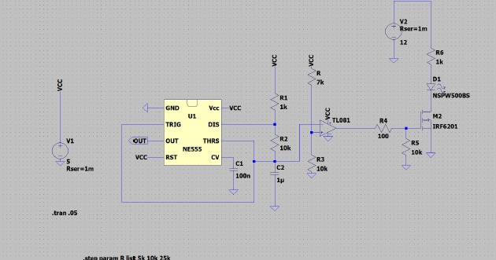
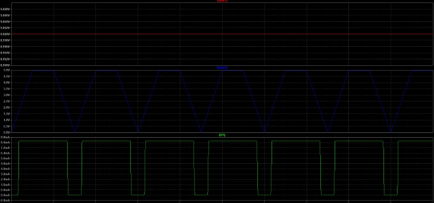
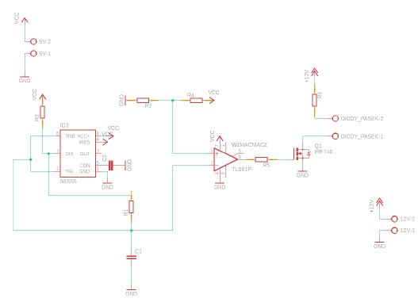
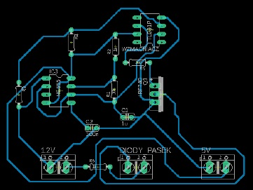

# Smart Flowerpot - Projekt:
## 📝 Założenia projektowe:
- Wyświetlanie temperatury otoczenia na dołączonym wyświetlaczu
- Wyświetlanie natężenia światła na dołączonym wyświetlaczu
- Wyświetlanie wilgotności gleby na dołączonym wyświetlaczu, z dodatkową
informacją o aktualnym stanie nawodnienia kwiatka, dostępne możliwości to:
“Podlej”, “Podlana” i “Przelana”
- Automatyczna regulacja oświetlenia dołączonego do doniczki na podstawie
odczytu z czujnika natężenia światła, zapewnia to stałe i optymalne warunki
do rozwoju rośliny niezależnie od pory dnia i warunków pogodowych.
- Do przetwarzania danych z czujników i wyświetlania ich na dołączonym
wyświetlaczu LCD wykorzystany zostanie mikrokontroler Arduino Uno R3,
natomiast kod odpowiedzialny za procedure tego przetwarzania napisany
zostanie w środowisku Arduino IDE.
- Do sterowania oświetleniem wykorzystany zostanie zaprojektowany przez nas
układ analogowy generujący sygnał PWM ze zmiennym wypełnieniem
zależnym od odczytu z czujnika natężenia światła(fotorezystorem)
- Wybór obudowy zapewniającej schludny, stosunkowo innowacyjny oraz
minimalistyczny wygląd
## 💡 Schemat pogladowy działania:

### ➖ Sterownik paska LED 'Smart_Flowerpot/LTspice':
Do zaprojektowania analogowej części układu wykorzystano program LTspice 
, Jest to część układu odpowiedzialna za generowanie sygnału PWM o
zmiennym wypełnieniu, a tym samym sterująca oświetleniem doniczki.

#### Szczegółowy opis układu:
Głównym elementem powyższego układu analogowego jest układ scalony
NE555(Rys.3). Odpowiada on za generację sygnału PWM, układ ten może
pracować w trybie monostabilnym, bądź astabilnym. W naszym projekcie
wykorzystujemy tryb astabilny w celu generacji ciągłego sygnału prostokątnego.
Rezystory R1, R2 odpowiadają za określenie częstotliwości generowanego
sygnału.
Kondensator C1 służy jako kondensator bocznikowy i zapewnia zasilanie o
niskiej impedancji, stabilizuje również działanie generatora PWM.
Wzmacniacz operacyjny TL081 pełni rolę komparatora, porównując napięcie
odniesienia z napięciem z dzielnika napięcia(w rzeczywistej wersji z napięciem z
mikrokontrolera Arduino Uno R3).
Tranzystor MOSFET IRF740 pod wpływem generowanego sygnału PWM
włącza się i wyłącza sterując diodą LED w sposób umożliwiający manipulację
natężeniem świecenia tych diod.
Pasek diod LED SMD5050 12V IP65 emituje światło o natężeniu zależnym od
współczynnika wypełnienia PWM, jej zasilanie kontrolowane jest przez tranzystor.
Źródło zasilania V1 dostarcza napięcie zasilania o wartości 5V do układu, jest
to napięcie podawane przez mikrokontroler.
Kondensator C2 oraz rezystor R3 filtrują napięcie odniesienia komparatora.
Rezystor R6 ogranicza prąd płynący przez pasek diod LED, chroniąc je tym
samym przed przepięciami.
Źródło zasilania V2 ma wartość 9V i dostarcza napięcie do obwodu diod LED.
#### Symulacja w programie LTspice:
Przeprowadzono symulacje działania, wcześniej omawianego układu
zaprojektowanego w programie LTspice. Podczas symulacji zbadano
napięcie zasilania obwodu diod(V(n001)), sygnał PWM podawany na bramkę
tranzystora(V(n005)) oraz prąd indukowany na diodach LED(I(D1)). Z
wykorzystaniem kursorów ustalono, że napięcie na bramce od którego prąd zaczyna
przepływać przez diody wynosi 1.72V, jest to wartość Vth(Gate Threshold Voltage)
poniżej zakresu podanego przez producenta, jednak należy wziąć pod uwagę, że
warunki dla których te zakresy zostały podane znacznie odbiegają od warunków w
zaprojektowanym, na potrzeby tego projektu układzie.

### ➖ Eagle:
#### Schemat układu:
Następnym krokiem po zaprojektowaniu układu i jego symulacji w programie
LTspice było wykonanie schematu płytki PCB w programie Eagle. W pierwszej
kolejności należało wykonać schemat układu w sposób podobny do wykonanego
uprzednio w LTspice, z tą różnicą, że schemat w programie Eagle uwzględnia
wszystkie bloki układu, jak i wymaga dobrania złączy kołkowych, listw zaciskowych,
bądź innego elementu umożliwiającego podłączenie zasilania. Na schemacie
można wyróżnić dwa bloki zasilające, główny obwód NE555 oraz wzmacniacza
wykorzystywanego jako komparator i obwód paska diod LED z tranzystorem
pełniącym rolę klucza między obwodem głównym, a obwodem diod LED.

#### Projekt PCB:
Następnie wykonano projekt płytki obwodu drukowanego z topologią
połączeń, wszystkie ścieżki poprowadzono w warstwie dolnej, przy
projektowaniu stosowano się do zasad zamieszczonych w dołączonym pliku
“OpenLab.dru”. Popełniono błąd przy dobieraniu wielkości pól lutowniczych, jednak
po wytrawieniu płytki udało się zrealizować w pełni działający układ. Topologia
połączeń została przemyślana i kilkukrotnie była optymalizowana, tak aby spełniała
kryteria i jednocześnie była uproszczona w jak największym stopniu. Zastosowano
trzy listwy zaciskowe - anody znajdują się po prawej stronie, natomiast katody po
lewej.

### ➖ Wykaz elementów:
Elementy wykorzystane do przygotowania płytki drukowanej:
- NE555
- Rezystory:
1. 2x 10kΩ
2. 1x 100Ω
3. 2x 1kΩ
- Kondensatory:
1. ceramiczny 100nF
2. elektrolityczny 1μF
- Wzmacniacz operacyjny TL081
- Tranzystor polowy IRF740
Poza elementami niezbędnymi do przygotowania płytki drukowanej
generującej sygnał PWM, w projekcie wykorzystano:
- Czujniki:
1. czujnik temperatury DS18B20 - cyfrowy czujnik temperaturowy z
interfejsem one-wire
2. czujnik wilgotności gleby firmy OEM - analogowy czujnik
składający się z sondy pomiarowej i modułu detektora
3. fotorezystor 10kΩ - pełniący role czujnika naświetlenia
- Arduino UNO R3 jako serce całego układu
- Wyświetlacz LCD
- Pasek LED SMD5050 12V IP65 pełniący rolę źródła światła
- Rezystory: x2 1[kΩ], x1 100 [Ω], x1 10 [kΩ]
- Kondensatory: x1 100 [nF], x1 1 [uF]
- Doniczka Agate 23 cm czarna VERDENIA
- Tranzystor IRF740
Całość układu jest zasilana bateryjne z 6 baterii umieszczonych w koszyku

