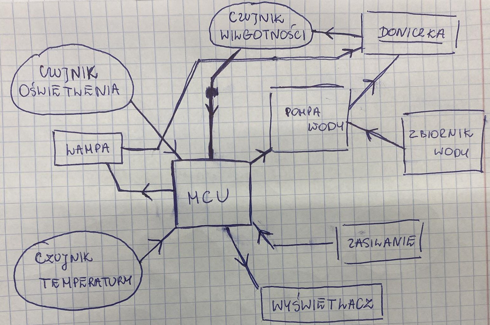

# Smart Flowerpot - Projekt:
## 📝 Założenia projektowe:
### ➖ Sterownik paska LED:
Symulacja sterownika przeprowadzona w programie LTspice 'Smart_Flowerpot/LTspice'.
### ➖ MCU - Arduino UNO:
Odpowiedzialny będzie on za obsługę naszych czujników, pompy wodnej oraz wyświetlanie na wyświetlaczu LCD odpowiednich parametrów. Kod oraz schemat połączeń 'Smart_Flowerpot/Arduino'.
#### Spis używanych czujników:
- Czujnik wilgotności gleby: MOD-01588,
- Czujnik temperatury otoczenia (analogowy): LM35DZ (?),
- Pompa wody (?),
- Wyświetlacz LCD.
### ➖ Wydrukowanie obudowy/doniczki w drukarce 3D:

## 💡 Schemat pogladowy działania:

